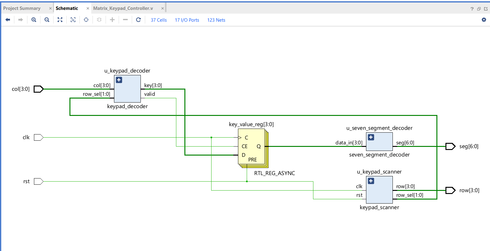
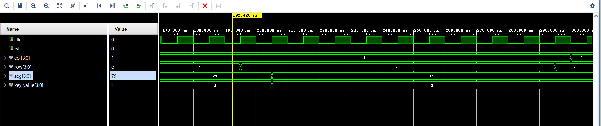

# Matrix Keypad Controller for Basys 3

A **4×4 Matrix Keypad Controller** implemented in **Verilog HDL** for the **Digilent Basys 3 FPGA**. The design scans the keypad, detects key presses, decodes them into hexadecimal values (0–F), and displays the result on the onboard seven-segment display.

## Features

- 4×4 matrix keypad scanning
- Hexadecimal key decoding (0–F)
- Seven-segment display output
- Modular Verilog design
- Verified using Vivado XSim

## RTL Schematic

## Simulation Result

## Tools Used

- Verilog HDL
- Xilinx Vivado
- Vivado XSim
- Digilent Basys 3 FPGA

---

**Author:** Samyak Shah